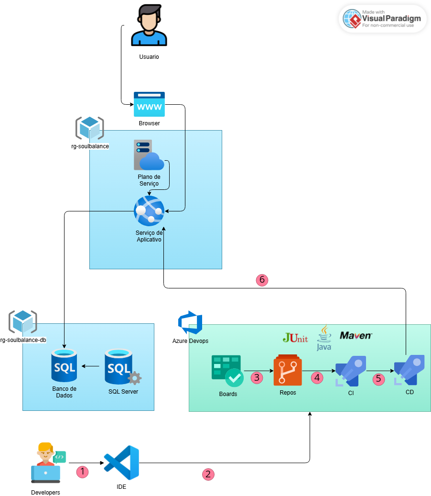

# SoulBalance

SoulBalance é uma aplicação Java Spring Boot para análise, recomendação e acompanhamento de atividades e dados de bem-estar, integrando sensores, check-ins manuais e envio de e-mails.


## Macro Arquitetura





## Funcionalidades
Spring Boot segue o padrão MVC, com controllers REST, services para lógica de negócio e repositórios JPA para persistência. O banco é Azure SQL Server.

## Exemplo de CRUD exposto em JSON (APIs)
## Tabela de Endpoints

| Recurso         | Método | Endpoint                                      | Descrição                       |
|-----------------|--------|-----------------------------------------------|----------------------------------|
| Usuários        | POST   | /usuarios                                     | Criar usuário                    |
| Usuários        | GET    | /usuarios                                     | Listar todos os usuários         |
| Usuários        | GET    | /usuarios/{idUsuario}                         | Buscar usuário por ID            |
| Usuários        | PUT    | /usuarios/{idUsuario}                         | Atualizar usuário                |
| Usuários        | DELETE | /usuarios/{idUsuario}                         | Excluir usuário                  |
| Atividades      | POST   | /atividade                                    | Criar atividade                  |
| Atividades      | GET    | /atividade                                    | Listar todas as atividades       |
| Atividades      | GET    | /atividade/users/{userId}/{atividadeId}/historico | Buscar histórico de atividade    |
| Atividades      | PUT    | /atividade/{atividadeId}                      | Atualizar atividade              |
| Atividades      | DELETE | /atividade/{atividadeId}                      | Excluir atividade                |
| Checkin Manual  | POST   | /checkin-manual                               | Criar checkin manual             |
| Checkin Manual  | GET    | /checkin-manual                               | Listar todos os checkins         |
| Checkin Manual  | GET    | /checkin-manual/historico/{idUsuario}         | Listar checkins por usuário      |
| Checkin Manual  | PUT    | /checkin-manual/users/{userId}/{chekinId}     | Atualizar checkin manual         |
| Checkin Manual  | DELETE | /checkin-manual/users/{userId}/{chekinId}/chekins | Excluir checkin manual           |
| Dados Sensor    | POST   | /dados-sensor                                 | Criar dado de sensor             |
| Dados Sensor    | GET    | /dados-sensor                                 | Listar todos os dados de sensor  |
| Dados Sensor    | PUT    | /dados-sensor/{idDadoSensor}                  | Atualizar dado de sensor         |
| Dados Sensor    | DELETE | /dados-sensor/{idDadoSensor}                  | Excluir dado de sensor           |
| Login           | POST   | /login                                        | Autenticar usuário (JWT)         |
| E-mail          | POST   | /email/enviar-email                           | Enviar e-mail                    |
| E-mail          | GET    | /email                                        | Listar e-mails enviados          |

### Usuários
**POST /usuarios**
```json
{
   "name": "João Silva",
   "email": "joao@email.com",
   "senha": "123456"
}
```

**GET /usuarios**
```json
[
   {
      "userId": 1,
      "nome": "João Silva",
      "email": "joao@email.com",
      "dataCriacao": "2025-11-22T10:00:00"
   }
]
```

**PUT /usuarios/{idUsuario}**
```json
{
   "name": "João S. Silva",
   "email": "joao@email.com",
   "senha": "novaSenha"
}
```

**DELETE /usuarios/{idUsuario}**

---

### Atividades
**POST /atividade**
```json
{
   "tipoAtividade": "EXERCICIO_FISICO",
   "inicio": "2025-11-22T08:00:00",
   "fim": "2025-11-22T09:00:00",
   "descricao": "Corrida matinal",
   "email": "joao@email.com"
}
```

**GET /atividade**
```json
[
   {
      "atividadeId": 1,
      "tipoAtividade": "EXERCICIO_FISICO",
      "descricao": "Corrida matinal",
      "duracaoMinutosAtividade": 60,
      "usuarioId": 1
   }
]
```

**PUT /atividade/{atividadeId}**
```json
{
   "tipoAtividade": "EXERCICIO_FISICO",
   "inicio": "2025-11-22T08:30:00",
   "fim": "2025-11-22T09:30:00",
   "descricao": "Corrida ajustada",
   "email": "joao@email.com"
}
```

**DELETE /atividade/{atividadeId}**

---

### Checkin Manual
**POST /checkin-manual**
```json
{
   "humor": "ALTO",
   "energia": "MEDIO",
   "foco": "BAIXO",
   "email": "joao@email.com"
}
```

**GET /checkin-manual**
```json
[
   {
      "chekinId": 1,
      "humor": "ALTO",
      "energia": "MEDIO",
      "foco": "BAIXO",
      "usuario": "joao@email.com"
   }
]
```

**PUT /checkin-manual/users/{userId}/{chekinId}**
```json
{
   "humor": "MEDIO",
   "energia": "ALTO",
   "foco": "ALTO",
   "email": "joao@email.com"
}
```

**DELETE /checkin-manual/users/{userId}/{chekinId}/chekins**

---

### Dados Sensor
**POST /dados-sensor**
```json
{
   "tipoDadoSensor": "SONO_HORAS",
   "valor": 7,
   "email": "joao@email.com"
}
```

**GET /dados-sensor**
```json
[
   {
      "dadoId": 1,
      "tipoDado": "SONO_HORAS",
      "valor": 7,
      "time": "2025-11-22T07:00:00",
      "usuarioId": 1
   }
]
```

**PUT /dados-sensor/{idDadoSensor}**
```json
{
   "tipoDadoSensor": "SONO_HORAS",
   "valor": 8,
   "email": "joao@email.com"
}
```

**DELETE /dados-sensor/{idDadoSensor}**

## Estrutura do Projeto
```
├── src/main/java/br/com/fiap/SoulBalance/
│   ├── controller/         # Controllers REST
│   ├── service/            # Lógica de negócio
│   ├── entity/             # Entidades JPA
│   ├── dto/                # Data Transfer Objects
│   ├── repository/         # Repositórios Spring Data
│   ├── exception/          # Tratamento de exceções
│   └── ...
├── src/main/resources/
│   └── application.properties
├── script_bd.sql           # Script de criação do banco (Azure SQL)
├── script_gs.sh            # Script de provisionamento Azure
├── pom.xml                 # Dependências Maven
```

## Banco de Dados
- Azure SQL Server
- Script de criação: `script_bd.sql`

## Configuração
1. Configure o banco de dados no Azure e ajuste as variáveis em `application.properties`.
2. Compile o projeto:
   ```sh
   ./mvnw clean install
   ```
3. Execute a aplicação:
   ```sh
   ./mvnw spring-boot:run
   ```


## Provisionamento e Deploy (scripts)
O script `script_gs.sh` automatiza o provisionamento completo no Azure:

- Criação dos Resource Groups (App e DB)
- Criação do Azure SQL Server + Database
- Execução do `script_bd.sql` via sqlcmd (DDL completa e seed inicial)
- Criação do App Service Plan (Linux) e do Web App Java 17
- Configuração das App Settings (string de conexão e variáveis do Spring)

**Notas importantes:**
- O arquivo `script_bd.sql` é executado pelo `script_gs.sh` (flag sqlcmd -i) para evitar expansão de variáveis e manter o hash BCrypt da senha.
- O seed cria o usuário ADMIN com senha padrão `admin123`, armazenada como hash BCrypt.
- Substitua as variáveis `SQL_ADMIN_USER`, `SQL_ADMIN_PASSWORD` e o hash no `script_bd.sql` antes de usar em produção.
- O script requer Azure CLI autenticada (`az login`) e bash. Para executar DDL/DML, requer sqlcmd (ou use Azure Cloud Shell Bash).
- Caso prefira apenas provisionar o banco/manual, execute `script_bd.sql` diretamente com:
   ```sh
   sqlcmd -S <server>.database.windows.net -d <db> -U <user> -P <senha> -N -b -i script_bd.sql
   ```

### Passo a passo (Azure)

#### Pré-requisitos
- Azure CLI logada: `az login`
- Ambiente com bash e sqlcmd (Windows: Git Bash/WSL + sqlcmd; alternativa: Azure Cloud Shell Bash)

#### Executar o deploy
```sh
./script_gs.sh
```

#### Após o deploy
Acesse: https://app-pt-rm556206.azurewebsites.net/swagger-ui/index.html

#### Teste rápido de funcionalidade
1. Acesse `/login` e autentique (criando a conta ou logando com o admin).
2. Utilize os endpoints REST para cadastrar atividades, check-ins, consultar dados, etc.
3. Consulte as tabelas no banco via Azure Portal ou sqlcmd.

#### Troubleshooting (Azure)
- `sqlcmd` falhou (DDL/DML): verifique firewall do Azure SQL e credenciais
- Loop no login: garanta que a senha no banco corresponde ao encoder (hash BCrypt para admin123)
- Erro 500 em endpoints: confira logs do App Service e variáveis de ambiente
- Falha de start no Web App: confira App Settings e veja o Log Stream

#### Acesso ao Banco de Dados (Azure SQL)
Você pode visualizar e consultar o banco provisionado no Azure SQL de duas formas:

**Azure Portal (Query editor):**
1. Abra o recurso do SQL Database no Portal Azure
2. Clique em "Query editor (preview) ou Editor de consultas"
3. Autenticação: SQL Login
    - Usuário: valor da variável `SQL_ADMIN_USER` definida no script
    - Senha: valor da variável `SQL_ADMIN_PASSWORD`

**Exemplo de consulta:**
```sql
SELECT TOP 10 * FROM TB_SOULBALANCE_USUARIO;
SELECT TOP 10 * FROM TB_SOULBALANCE_ATIVIDADE;
```

**Variáveis úteis no script_gs.sh:**
- `SQL_SERVER_NAME`: nome do servidor lógico do Azure SQL (ex.: sql-server-smartmottu)
- `SQL_DB_NAME`: nome do banco (ex.: db-smartmottu)
- `SQL_ADMIN_USER`: usuário admin SQL
- `SQL_ADMIN_PASSWORD`: senha do admin SQL (substitua em produção)

#### Testes via HTTP (opcional)
Como a aplicação usa login por formulário, recomenda-se testar via navegador ou ferramentas como Postman para os endpoints REST.

## Testes
Os testes estão localizados em `src/test/java/br/com/fiap/SoulBalance/`.

## Requisitos
- Java 17
- Maven
- Azure CLI (para provisionamento)